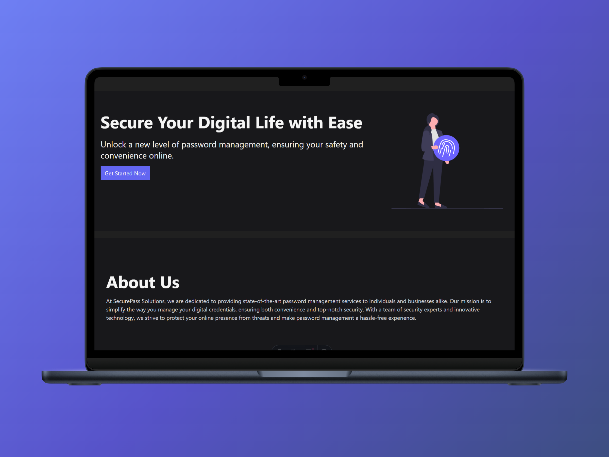
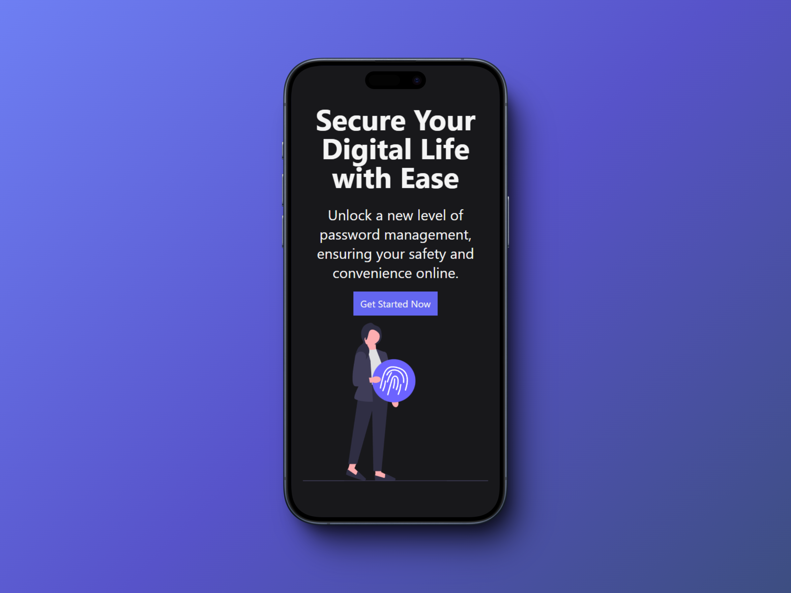

# 🚀 SecurePass Solutions

## 📖 Project Description
SecurePass Solutions is a web application that simulates a website offering password management services. 

## 🛠️ Technologies Used
 

## 📚 What I Learned
This was my first project using Astro. I learned the basic fundamentals of the framework, including pages in Astro and components.

## 📫 Contact Information

 
 
 
 
